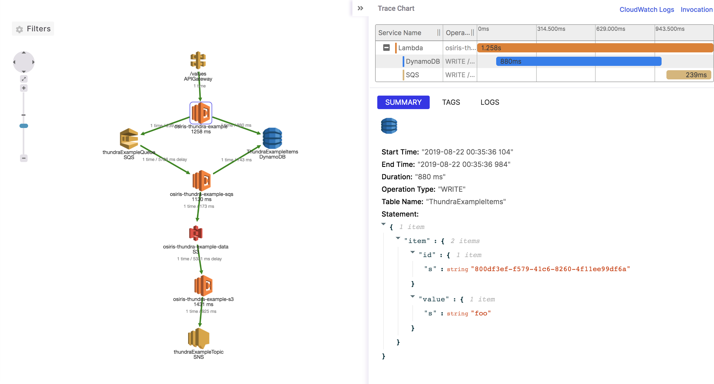

# Thundra Example Project

This project demonstrates how to integrate Osiris with Thundra debugging and monitoring platform (https://thundra.io).

## How to Integrate

### By `LambdaRequestHandlerExecutor`

`io.thundra.agent.lambda.core.handler.request.LambdaRequestHandlerExecutor` can be used to execute given `java.util.function.Supplier` typed handler. 

Example of this approach can be seen in the `ApiDefinition.kt` where a filter is defined which is applied to all requests. 
The filter handles the request by calling `LambdaRequestHandlerExecutor.execute()`. It passes in the event and context that were passed to the Osiris lambda by AWS. 
It also passes in an anonymous function (`Supplier`) that invokes the handler with the request. This dispatches the request to the appropriate handler.

### By Implementing from `ThundraLambdaRequestHandler`

Implement from Thundra’s `io.thundra.agent.lambda.core.handler.request.LambdaRequestHandler` instead of AWS Lambda API’s `com.amazonaws.services.lambda.runtime.RequestHandler`. 
Then update method name `handleRequest`, which is inherited from AWS Lambda API’s `RequestHandler`, as `doHandleRequest` which is inherited from Thundra’s `LambdaRequestHandler`.
See the [doc](https://docs.thundra.io/docs/java-installation-and-configuration#section-without-aws-lambda-layers) for details.

Example of this approach can be seen in the `SqsLambda.kt` which is implements from Thundra's `LambdaRequestHandler`.

### By `ThundraLambdaHandler`

You can set `io.thundra.agent.lambda.core.handler.ThundraLambdaHandler` as the main handler in the Lambda configuration and 
specify your original handler to Thundra through `thundra_agent_lambda_handler` environment variable by its full classname to delegate the request.

Example of this approach can be seen in the `S3Function`. It is defined in the `root.template` with 
Thundra's `ThundraLambdaHandler` as main handler and `S3Lambda` handler is defined by the `thundra_agent_lambda_handler` 
environment variable with the `ws.osiris.example.thundra.core.S3Lambda` value

### By Layer

By layer approach, you don't need to Thundra dependency at compile/build time because it will be provided at runtime by layer. 

See the [doc](https://docs.thundra.io/docs/java-installation-and-configuration#section-with-aws-lambda-layers) for details.

## Deploying the Project

In order to deploy the project you need to:

* Get a Thundra account (https://thundra.io)
* Update the `thundra.apiKey` property in `src/main/resources/app-config.properties` file with your API key.
* Make sure that default AWS profile under `$USER_HOME/.aws/credentials` has enough permissions to deploy.
* Run `mvn clean package deploy`. If you want to specify different AWS profile rather than default profile, 
you can add `-Dosiris.awsProfile=<YOUR-AWS-PROFILE-NAME>` argument to deploy command. 

## Making Requests

In order to see the project working you will need to make some POST requests. The easiest way to do this is to use `curl` in a terminal or to use [Postman](https://www.getpostman.com/).

This will create an item in the DynamoDB table with a value "foo" and publish a message to SQS. 
A lambda will receive the SQS message and create an object in S3. 
Then another Lambda will be triggered from S3 event and will send a notification message to SNS topic.

    curl -d foo https://${appId}.execute-api.${region}.amazonaws.com/dev/values

All requests will be recorded by Thundra and visible in the Trace map of the Thundra platform.

Individual traces can be viewed in the Thundra platform:

